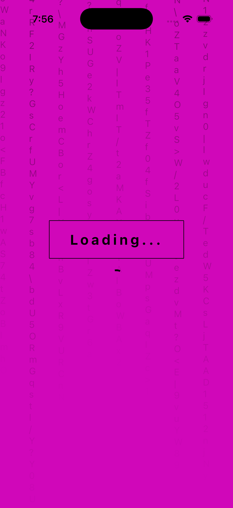
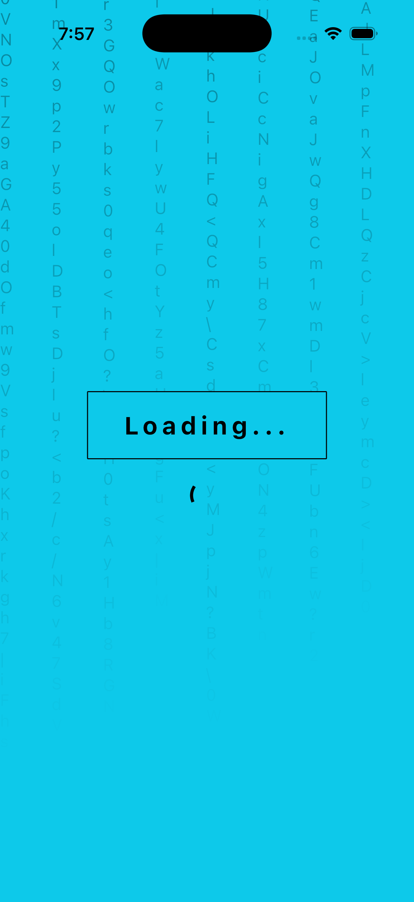
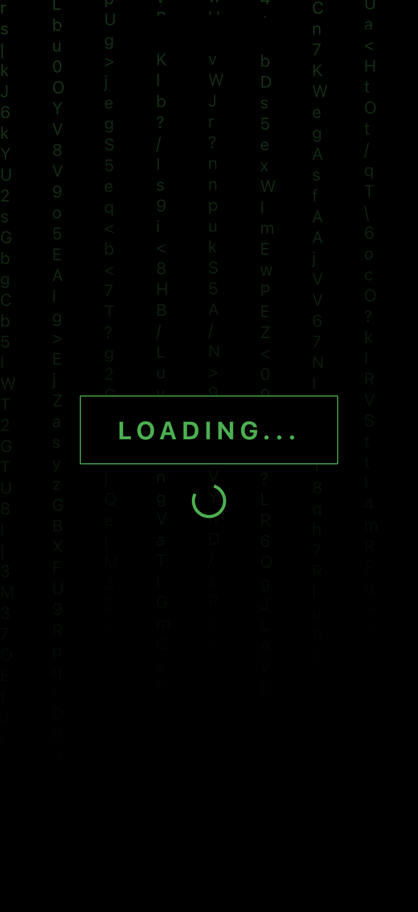

<!--
This README describes the package. If you publish this package to pub.dev,
this README's contents appear on the landing page for your package.

For information about how to write a good package README, see the guide for
[writing package pages](https://dart.dev/tools/pub/writing-package-pages).

For general information about developing packages, see the Dart guide for
[creating packages](https://dart.dev/guides/libraries/create-packages)
and the Flutter guide for
[developing packages and plugins](https://flutter.dev/to/develop-packages).
-->

# Matrix Waiting Screen


A Flutter package that provides a cool "Matrix" style rain effect waiting screen. Perfect for loading screens or splash screens.

## Features

- **Matrix Rain Effect**: Classic falling characters animation.
- **Customizable**: Change the text color and background color.
- **Responsive**: Adapts to screen size and orientation changes.
- **Lightweight**: Pure Dart/Flutter implementation.

## Screenshots

|                 Default                 |              Red Theme              |              Blue Theme              |
| :-------------------------------------: | :---------------------------------: | :----------------------------------: |
|  |  |  |

## Getting started

Add the dependency to your `pubspec.yaml`:

```yaml
dependencies:
  matrix_waiting_screen: ^0.0.1
```

## Usage

Import the package:

```dart
import 'package:matrix_waiting_screen/matrix_waiting_screen.dart';
```

Use the widget in your app:

```dart
// Simple usage with default values (Green on Black, "LOADING...")
MatrixWaitingScreen()

// Customized usage
MatrixWaitingScreen(
  title: "SYSTEM HACK",
  textColor: Colors.red,
  backgroundColor: Colors.black,
)
```

## Additional information

This package is open source. Feel free to contribute or report issues on GitHub.
